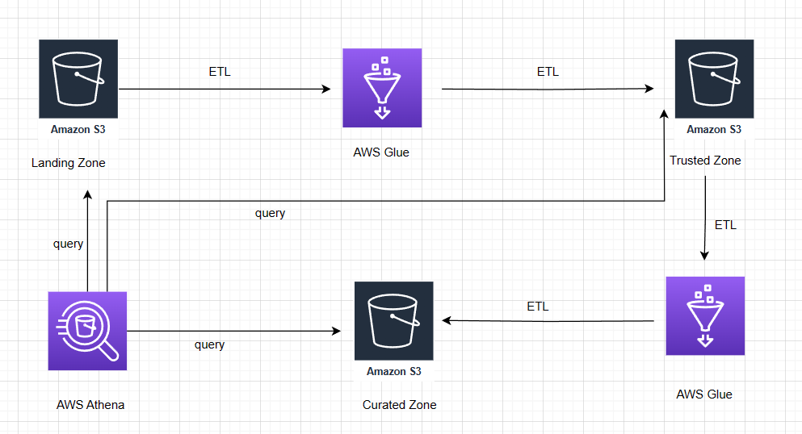

# Step Trainer analytics project with use of AWS
## Introduction
In this project, as a data engineer for the STEDI team I built a data lakehouse solution for sensor data that trains a machine learning model.
### Project details
I developed an ETL pipeline to model data for the machine learning model used by the Step Trainer hardware.  The Step Trainer itself is a motion sensor that records the distance an object travels.  The accompanying mobile app uses the phone's accelerometer to capture motion data across the X, Y, and Z axes.  
The purpose of the Step Trainer hardware is to: 
<ul>
<li> trains the user to do a STEDI balance exercise;</li>
<li>and has sensors on the device that collect data to train a machine-learning algorithm to detect steps;</li>
<li>has a companion mobile app that collects customer data and interacts with the device sensors.</li>
</ul>

## Project Summary
Inorder to perform this project, I curated the data into a data lakehouse solution on AWS for the machine-learning model. I used the following tools:

> Python and Spark
> 
> AWS Glue
> 
> AWS Athena
> 
> AWS S3

### Considerations
Data privacy is a key consideration when determining which data to use, especially while ensuring the real-time accuracy of motion sensor data.  For this project, only the Step Trainer and accelerometer data from early adopters who have consented to share their data for research purposes should be used to train the machine learning model.

## Datasets
### Customer records
contains the following fields:

- serialnumber
- sharewithpublicasofdate
- birthday
- registrationdate
- sharewithresearchasofdate
- customername
- email
- lastupdatedate
- phone
- sharewithfriendsasofdate

### Step Trainer Records (data from the motion sensor)
contains the following fields:
- sensorReadingTime
- serialNumber
- distanceFromObject

### Accelerometer Records (from the mobile app):
contains the following fields:
- timeStamp
- user
- x
- y
- z

## Solution 
<figure>
    <figcaption> Data Process </figcaption>
     

### Landing Zone - Data Ingestion
Raw data is ingested from S3 buckets in the landing zone into Glue jobs for ETL processing.  Glue tables are created from these S3 buckets, enabling querying via Athena before transformation.

### Customer Consent and Data Sanitization (Trusted Zone)
Customer data from the website (landing zone) is sanitized, retaining only records from customers who have consented to share their data for research purposes.  Similarly, accelerometer data from the mobile app (landing zone) is sanitized, storing only readings from consenting customers.  Both sanitized datasets reside in the trusted zone.

### Curated Data for Machine Learning (Curated Zone)
Customer data in the trusted zone is further processed to include only those customers who both have accelerometer data and have provided research consent. This refined customer dataset is stored as a Glue table in the curated zone.  The Step Trainer IoT data stream (from S3) is also loaded into a Glue table within the trusted zone.

Finally, a curated table, `machine_learning_curated`, is created in the curated zone. This table aggregates Step Trainer readings with corresponding timestamped accelerometer data, but only for customers who have agreed to data sharing
